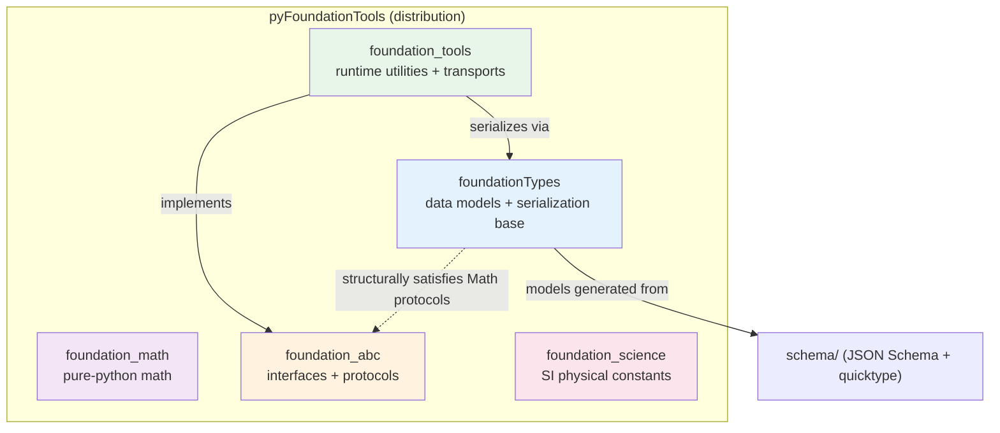
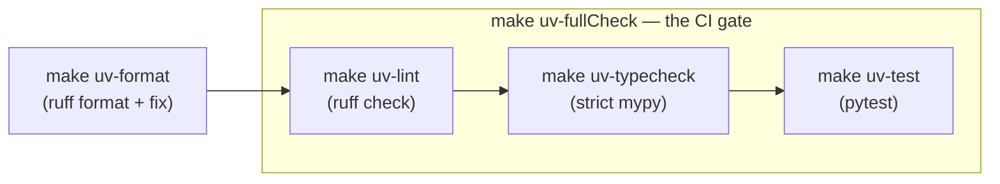

# pyFoundationTools — Documentation

`pyFoundationTools` is a **zero-runtime-dependency** Python library (>= 3.10) that extends the standard library with reusable, well-typed building blocks. Nothing in `[project].dependencies` — every feature here is pure standard library.

These docs are organized by top-level module. Each module page explains what the module is for, its public surface, and how the pieces fit, with diagrams for the parts where the shape matters more than the signature.

## The five packages

The source uses a `src/` layout with **five independently-importable top-level packages** (there is no single umbrella namespace — you import each package by its own name). `pyFoundationTools` is only the distribution name on PyPI.



| Package | One-liner | Doc |
|---|---|---|
| `foundationTypes` | Data models + the `DataModelHelper` serialization base class — the heart of the library | [foundationTypes.md](foundationTypes.md) |
| `foundation_math` | Pure-Python math helpers (`clamp`, `wrap`) | [foundation_math.md](foundation_math.md) |
| `foundation_abc` | Device/transport ABCs and structural Math protocols | [foundation_abc.md](foundation_abc.md) |
| `foundation_tools` | Runtime utilities: structured logger, path tools, and the full transport/transaction stack | [foundation_tools.md](foundation_tools.md) |
| `foundation_science` | SI physical constants, each carrying unit + uncertainty metadata | [foundation_science.md](foundation_science.md) |

## Import convention

Import the **package name directly** — there is no `pyFoundationTools.` prefix.

```python
from foundationTypes.data_model_helper import DataModelHelper
from foundation_math.math import clamp, wrap
from foundation_tools.cli_transaction.cliTransact import CLITransact
from foundation_science.constants.universal import R_UNIVERSAL
```

## Install & develop

```bash
pip install pyFoundationTools          # from PyPI
make installDev   # or: make e         # editable install for local development
```

Everyday workflows go through the Makefile (`make help` lists them). The `uv-` targets are the primary, self-contained path; bare targets are the pip fallback.



Run **`make uv-fullCheck`** before considering any change done — it is the lint + typecheck + test gate. Tooling is **ruff** (line length 100, double quotes) and **strict mypy**; trust the Makefile over the README for tool choices.
