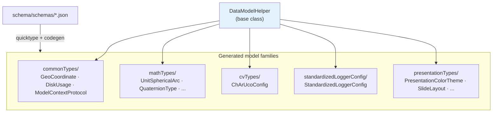
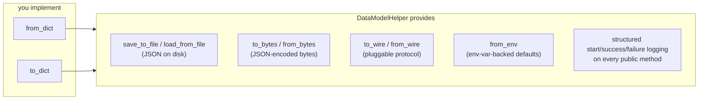
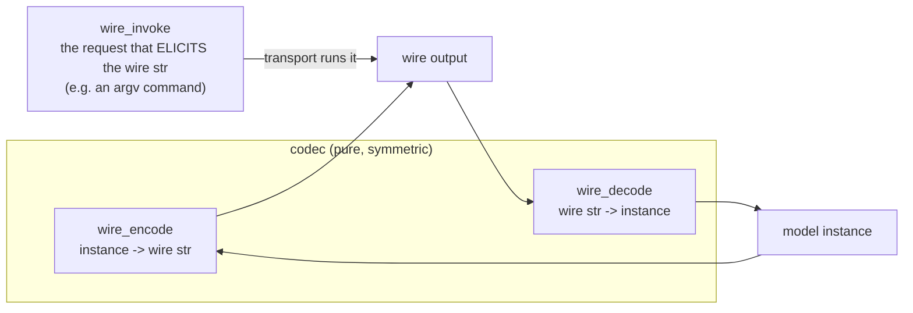
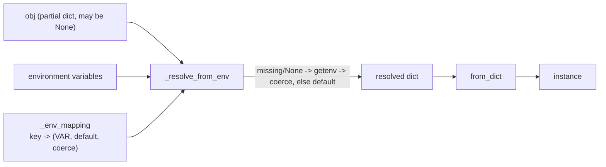
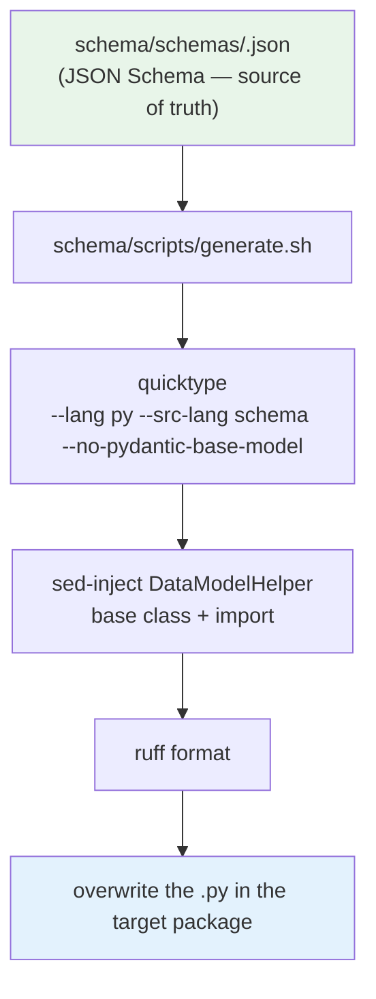

# foundationTypes

The data-model layer — and the heart of the library. Everything here is built on one base class, `DataModelHelper`, which gives every model a uniform serialization surface: dicts, JSON files, bytes, a pluggable wire protocol, and environment-backed construction.

Most models are **generated from JSON Schema**, not hand-written. That pipeline is covered at the end.



## DataModelHelper — the central contract

`foundationTypes/data_model_helper.py`. Every data model is a `@dataclass` subclassing `DataModelHelper`. A subclass implements just **two** methods; the base class provides everything else.

```python
from dataclasses import dataclass
from typing import Any
from foundationTypes.data_model_helper import DataModelHelper

@dataclass
class UserModel(DataModelHelper):
    name: str
    age: int

    @classmethod
    def from_dict(cls, obj: Any) -> "UserModel":
        return cls(name=obj["name"], age=obj["age"])

    def to_dict(self) -> dict:
        return {"name": self.name, "age": self.age}
```

- **`from_dict(obj) -> Self`** — type-validated construction from a plain dict. The base raises `NotImplementedError`; quicktype-generated subclasses implement it (often as a `@staticmethod`).
- **`to_dict(self) -> dict`** — plain-dict serialization.

Everything below is built on those two.

### What you get for free



| Method | What it does |
|---|---|
| `save_to_file(path)` / `load_from_file(path)` | JSON file I/O; `save` creates parent dirs and writes indented UTF-8 JSON |
| `to_bytes(encoding="utf-8")` / `from_bytes(...)` | JSON-encoded bytes for storage or network |
| `to_wire(**kw)` / `from_wire(wire_str)` | encode/decode via the pluggable wire codec (below) |
| `from_env(obj=None)` | construct with environment-variable-backed defaults (below) |

Every public method logs a debug "start", a debug "success", and — on exception — an `error` with `exc_info=True`, then re-raises. Serialization failures are never swallowed.

### The three-slot wire contract

The wire layer is **three independent ClassVars**, assigned externally (never baked into a generated `.py`). Keeping invocation separate from the codec is deliberate:



| ClassVar | Type | Role |
|---|---|---|
| `wire_encode` | `Callable[..., str] \| None` | serialize an instance to the wire string |
| `wire_decode` | `Callable[..., Any] \| None` | parse a wire string back into an instance |
| `wire_invoke` | `str \| list[str] \| type[DataModelHelper] \| None` | the class-level *request* that produces the wire string (e.g. `["df", "-h"]`) |

`to_wire`/`from_wire` raise `NotImplementedError` with a pointed message if the matching codec half is unset. `wire_invoke` is what lets a transport layer be called with the **model class alone** — see the `CLITransact.run_sync_with_model(DiskUsage)` bridge in [foundation_tools.md](foundation_tools.md#the-model-bridge). Pairing `wire_invoke` with `from_wire` is a contract of the *transport layer*, not of the model.

### Environment-backed construction

`from_env` fills missing/`None` values from environment variables before calling `from_dict`. Configure it with the `_env_mapping` ClassVar: `{json_key: (env_var_name, default, coercion_fn)}`.



### Quicktype-style converter helpers

The module also exports a family of assert-based converters — `from_bool`, `from_float`, `from_union`, `from_list`, `from_str`, and their `to_*` mirrors. These match **quicktype's** generated helper names, because models are meant to be generated. Generated `from_dict`/`to_dict` bodies call them to validate each field's type as it is read or written.

## Model families

All under `foundationTypes/`, all subclassing `DataModelHelper`:

| Package | Contents |
|---|---|
| `commonTypes/` | `GeoCoordinate`, `ModelContextProtocol`, and `disk_usage/` (`DiskUsage` + hand-written `wire_config.py`) |
| `mathTypes/` | concrete Math-domain models (spherical arcs/circles, quaternion types) — the tier-1 ABCs they mirror live in [foundation_abc](foundation_abc.md) |
| `cvTypes/` | `ChArUcoConfig` (computer-vision calibration board config) |
| `standardizedLoggerConfig/` | `StandardizedLoggerConfig`, consumed by the logger in [foundation_tools](foundation_tools.md#standardizedlogger) |
| `presentationTypes/` | the Presentations schema: `PresentationColorTheme`, `SlideLayout`, `Region`, `PresentationSlideLayouts`, and more — resolved by the `foundation_tools/presentation/` helpers |

### The `wire_config.py` sibling pattern

A model that needs hand-written wire behavior lives in **its own subfolder** next to a `wire_config.py`, rather than editing the generated `.py`. The folder's `__init__.py` imports `wire_config` for its side effect, so the wiring activates on any import. `commonTypes/disk_usage/` is the canonical shape:

```
commonTypes/disk_usage/
├── __init__.py        # imports wire_config for its side effect
├── DiskUsage.py       # GENERATED — do not hand-edit
└── wire_config.py     # hand-written: assigns wire_encode / wire_decode / wire_invoke
```

`DiskUsage.wire_invoke = ["df", "-h"]`, `wire_decode` parses `df` text output (handling both Linux and macOS column layouts), and `wire_encode` renders it back. That is what makes `CLITransact.run_sync_with_model(DiskUsage)` run `df -h` and hand back a parsed `DiskUsage` with no extra arguments.

## Schema-driven model generation

Models under `commonTypes/`, `mathTypes/`, `cvTypes/`, and `standardizedLoggerConfig/` are **generated from JSON Schema — do not hand-edit them.** Editing the generated `.py` directly is lost on the next regeneration. To change a model's shape, edit its schema and regenerate. Full contract: [`.claude/specs/schemaCodegen.md`](../.claude/specs/schemaCodegen.md).



Requirements: `quicktype` (npm global) and a formatter. Scripts `cd` to repo root so they run from anywhere, and use BSD-`sed` (macOS). Regenerate everything in one pass with:

```bash
make codegen-all
```
