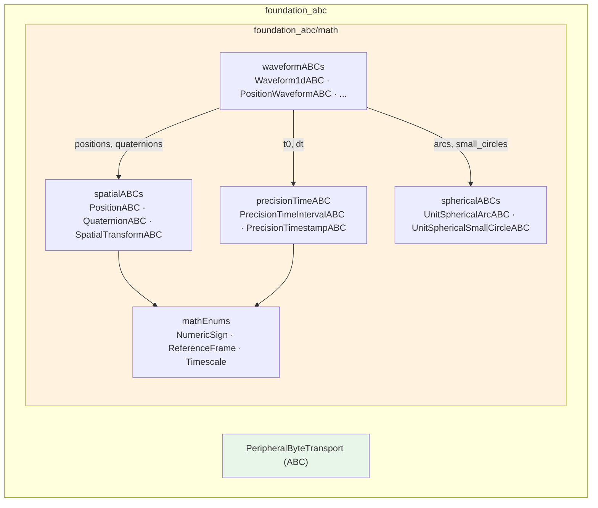
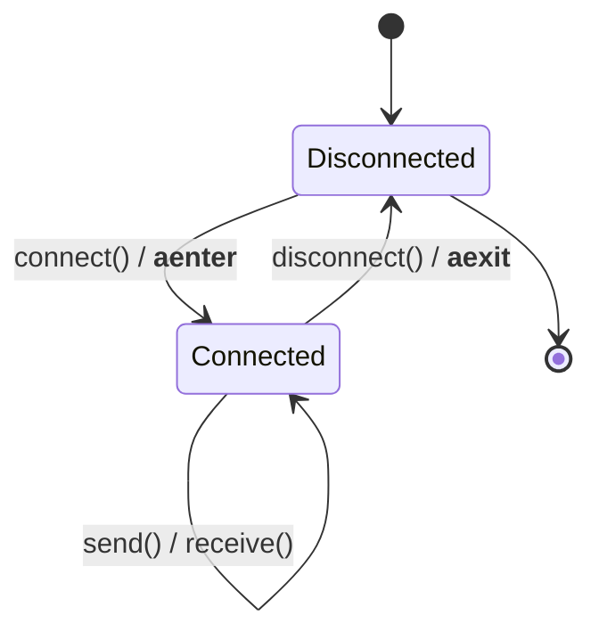
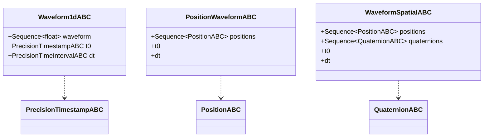

# foundation_abc

Abstract base interfaces shared across implementations. These define *contracts* — no concrete behavior, no I/O — so that device/transport code and the Math domain can depend on a stable shape rather than a particular class.

Two families live here:

1. **`peripheralByteTransport`** — the async byte-transport interface for devices.
2. **`foundation_abc/math/`** — stdlib-only `XxxxLike` ABCs for the Math domain (spatial, spherical, waveform, precision time) plus their enums.



## PeripheralByteTransport

`foundation_abc/peripheralByteTransport.py` defines `PeripheralByteTransport`, an `ABC` for **fully-asynchronous, byte-only** device transports. It deliberately knows nothing about protocol framing (STX/ETX, checksums, BCC) — that belongs to device handlers layered on top.

| Member | Signature | Purpose |
|---|---|---|
| `connect` | `async def connect() -> None` | Open the transport |
| `disconnect` | `async def disconnect() -> None` | Close the transport |
| `send` | `async def send(data: bytes) -> None` | Write raw bytes |
| `receive` | `async def receive(size: int, timeout: float = 1.0) -> bytes` | Read up to `size` bytes |
| `is_connected` | `def is_connected() -> bool` | Connection state |
| context mgr | `__aenter__` / `__aexit__` | Use as `async with` |



### Implementations and consumers

- A serial (RS485/USB) implementation exists elsewhere on top of this interface; an EtherCAT adapter (translating PDO process-image offsets to this byte-stream contract) is planned.
- Within this repo, `foundation_tools.socket_transaction.SocketByteTransport` implements this ABC over a TCP socket — see [foundation_tools.md](foundation_tools.md#socket-transaction).

```python
from foundation_abc.peripheralByteTransport import PeripheralByteTransport

class MyTransport(PeripheralByteTransport):
    async def connect(self) -> None: ...
    async def disconnect(self) -> None: ...
    async def send(self, data: bytes) -> None: ...
    async def receive(self, size: int, timeout: float = 1.0) -> bytes: ...
    def is_connected(self) -> bool: ...

async with MyTransport() as t:      # connect() / disconnect() run automatically
    await t.send(b"PING")
    reply = await t.receive(64)
```

## The Math-domain ABCs (`foundation_abc/math/`)

These are the stdlib-only *tier-1* interfaces of the Math domain. They describe geometry and time-series shapes without importing anything heavy, so that both hand-written and schema-generated models can conform. See [`.claude/specs/mathTypeTiers.md`](../.claude/specs/mathTypeTiers.md) for the tiering rationale; the schema-generated concrete models live in `foundationTypes/mathTypes/` ([foundationTypes.md](foundationTypes.md)).

Every ABC exposes read-only properties plus `to_dict()` / `from_dict()`, mirroring the `DataModelHelper` serialization contract so implementers slot cleanly into the rest of the library.

### Enums (`mathEnums.py`)

| Enum | Members represent |
|---|---|
| `NumericSign` | Sign of a quantity (positive / negative / zero) |
| `ReferenceFrame` | The frame a spatial quantity is expressed in |
| `Timescale` | The timescale a timestamp is measured against |

### Precision time (`precisionTimeABC.py`)

Sub-nanosecond time modeled as integers to avoid float drift:

- **`PrecisionTimeIntervalABC`** — a duration: `seconds` + `attoseconds`, with a `sign` and `is_zero` / `is_positive` / `is_negative` helpers.
- **`PrecisionTimestampABC`** — an instant: `seconds` + `attoseconds`, plus `reference_frame`, `timescale`, `uncertainty`, and epoch comparisons (`is_epoch`, `is_after_epoch`, `is_before_epoch`).

### Spatial (`spatialABCs.py`)

- **`PositionABC`** — `x`, `y`, `z`.
- **`QuaternionABC`** — `w`, `x`, `y`, `z` (3D orientation).
- **`SpatialTransformABC`** — a `position` + an `orientation` (a full pose).

### Spherical (`sphericalABCs.py`)

- **`UnitSphericalArcABC`** — an arc on the unit sphere (`azimuth`, `polar`, `orient`, `arc_length`).
- **`UnitSphericalSmallCircleABC`** — a small circle (`azimuth`, `polar`, `radius_angle`).

### Waveforms (`waveformABCs.py`)

Uniformly-sampled time series. Each waveform carries a start time `t0` (a `PrecisionTimestampABC`) and a sample spacing `dt` (a `PrecisionTimeIntervalABC`), plus a sequence of samples whose element type names the waveform:

| ABC | Sample element |
|---|---|
| `Waveform1dABC` | `float` |
| `PositionWaveformABC` | `PositionABC` |
| `QuaternionWaveformABC` | `QuaternionABC` |
| `WaveformSpatialABC` | positions **and** quaternions (pose stream) |
| `WaveformUnitSphericalArcABC` | `UnitSphericalArcABC` |
| `WaveformUnitSphericalSmallCircleABC` | `UnitSphericalSmallCircleABC` |


