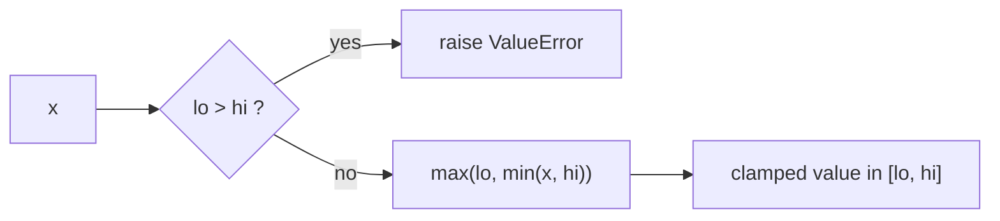
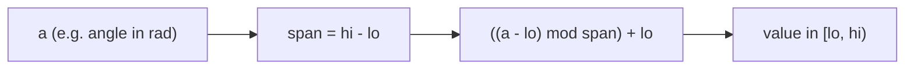

# foundation_math

Pure-Python math utilities with no external dependencies. Small, exact, and defensively validated.

Import from `foundation_math.math`.

## Functions

### `clamp(x, lo, hi) -> float`

Constrain `x` to the inclusive range `[lo, hi]`. Raises `ValueError` if `lo > hi` — an inverted range is a programming error, not something to silently paper over.

```python
from foundation_math.math import clamp

clamp(15, 0, 10)   # -> 10
clamp(-3, 0, 10)   # -> 0
clamp(5, 0, 10)    # -> 5
clamp(5, 10, 0)    # -> ValueError: lower bound cannot exceed upper bound
```



### `wrap(a, lo=-pi, hi=pi) -> float`

Normalize a value into the half-open range `[lo, hi)` by modular wrapping. The default bounds `[-pi, pi)` make it a drop-in angle normalizer for radians.

```python
from math import pi
from foundation_math.math import wrap

wrap(3 * pi)          # -> ~ -pi  (wraps back into [-pi, pi))
wrap(370, 0, 360)     # -> 10.0   (works for any range, not just angles)
```

The implementation is `((a - lo) % span) + lo` where `span = hi - lo` — the modulo does the wrapping in a single branchless expression.



## When to reach for this module

Use `clamp`/`wrap` anywhere you would otherwise write a manual `min(max(...))` or a hand-rolled angle-normalization. Centralizing them keeps the bound-ordering check and the half-open-range semantics in one tested place instead of re-deriving them per call site.
