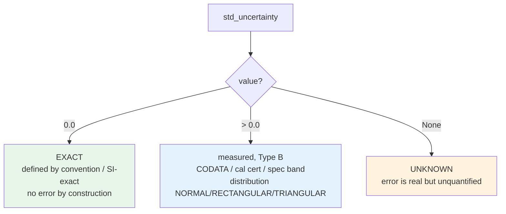
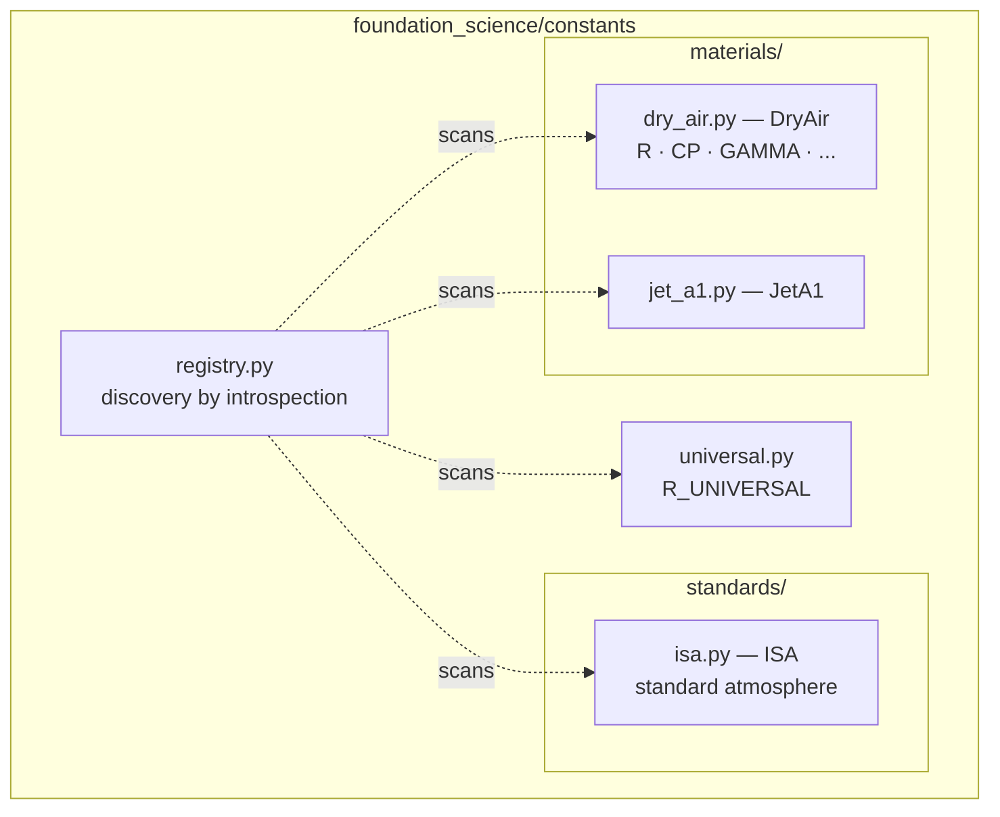

# foundation_science

SI physical constants that **carry their own metadata**. Every value is a `Constant` — a `float` subclass that also knows its unit, its standard uncertainty, the shape of that uncertainty, and where it came from.

The point of the module is to make one specific mistake *unrepresentable*: writing down a physical constant without deciding what its uncertainty is. See [`.claude/specs/physicalConstants.md`](../.claude/specs/physicalConstants.md) for the full contract.

Scope note: **scalar constants only.** Tables, force-field parameter sets, and a `metrology` uncertainty-propagation layer are deliberately out of scope for now.

## The `Constant` type

`foundation_science/constants/constant.py` defines `Constant(float)`. Because it subclasses `float`, a `Constant` *is* a number — it drops straight into any arithmetic. Arithmetic returns a plain `float` and **drops the metadata by design**: the moment you combine two constants, the result's provenance is no longer any single citation, so the type refuses to fake one.

```python
from foundation_science.constants.universal import R_UNIVERSAL

R_UNIVERSAL                      # Constant, value 8.314462618, unit "J mol^-1 K^-1"
R_UNIVERSAL.unit                 # "J mol^-1 K^-1"
R_UNIVERSAL.std_uncertainty      # 0.0  (SI-exact since the 2019 redefinition)
R_UNIVERSAL * 2                  # plain float 16.628... — metadata intentionally gone
```

### Every field is required

There are no default arguments on the constructor. Omitting the uncertainty is not possible, which makes "I didn't think about it" impossible to express at the definition site.

| Field | Type | Meaning |
|---|---|---|
| value | `float` | the number, in `unit` |
| `unit` | `str` | SI unit string; `"1"` for dimensionless |
| `std_uncertainty` | `float \| None` | standard uncertainty at **k=1** (three-state, below) |
| `distribution` | `Distribution` | how that uncertainty is distributed |
| `source` | `str` | citation for the value |

### The three-state uncertainty rule

`std_uncertainty` has three distinct states, and **`None` is not `0.0`**. Conflating them is exactly the failure this type prevents — a `0.0` for an unquantified value claims perfection and silently shrinks every error budget that consumes it.



The constructor enforces coherence between `distribution` and `std_uncertainty` and raises `ValueError` on an incoherent pairing:

- `Distribution.EXACT` ⟺ `std_uncertainty == 0.0`
- `Distribution.UNKNOWN` ⟺ `std_uncertainty is None`
- `NORMAL` / `RECTANGULAR` / `TRIANGULAR` ⟺ a **positive, finite** `std_uncertainty`

### `Distribution`

A genuine closed set, so it is an `Enum` (the constants themselves are not):

| Member | Meaning | Standard uncertainty |
|---|---|---|
| `EXACT` | defined by convention or the SI | 0 by construction |
| `NORMAL` | Gaussian | stored value = σ (k=1) |
| `RECTANGULAR` | uniform over ±a | u = a/√3 |
| `TRIANGULAR` | triangular over ±a | u = a/√6 |
| `UNKNOWN` | representative value, error unquantified | `None` |

### Convenience constructors — normalize to k=1 on the way in

Sources quote uncertainty in different conventions. These classmethods convert **at the definition site**, where the convention is still known, so everything downstream can assume k=1 without guessing.

```python
from foundation_science.constants.constant import Constant, Distribution

# A ±a half-width (e.g. a datasheet tolerance band):
c = Constant.from_half_width(1.5, half_width=0.2, unit="V", source="datasheet",
                             distribution=Distribution.RECTANGULAR)   # stores 0.2/√3

# An expanded uncertainty U at k=2 (calibration certificates):
c = Constant.from_expanded(9.81, expanded=0.04, unit="m s^-2", source="cal cert", k=2.0)  # stores 0.02
```

`relative_std_uncertainty` returns the uncertainty as a fraction of the value, or `None` when the uncertainty is unknown or the value is zero.

## How constants are organized

Grouped **substance-major** — each physical substance or standard is one class/module, so all of its properties live together rather than fragmenting across property-major files.



## The registry — discovery, not a hand-maintained list

`registry.py` finds every constant by introspection so nothing has to be registered by hand (and nothing can be forgotten). This backs the CI audit that checks each constant is coherent.

- `iter_module_constants(module)` — yield `(qualified_name, constant)` for one module.
- `iter_constants()` — walk **every** submodule under `foundation_science.constants` and yield all of them.

```python
from foundation_science.constants.registry import iter_constants

for name, c in iter_constants():
    print(f"{name:50} {float(c):>15} {c.unit:20} u={c.std_uncertainty}")
```
