# foundation_tools

The runtime-utilities package. It holds the structured logger, filesystem helpers, and the library's largest subsystem: a four-layer **transport / transaction stack** for running commands locally, over SSH, via rsync, and over TCP sockets.

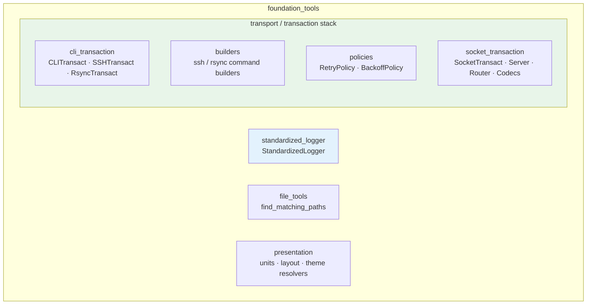

Contents:
- [The transport / transaction architecture](#the-transport--transaction-architecture) (the 4-layer model)
- [cli_transaction: CLITransact](#cli_transaction-clitransact) — the kernel
- [Command builders](#command-builders)
- [Execution policies](#execution-policies) — retry + backoff
- [SSH and rsync transactions](#ssh-and-rsync-transactions)
- [socket_transaction](#socket-transaction) — the async TCP stack
- [file_tools](#file_tools)
- [presentation](#presentation)
- [StandardizedLogger](#standardizedlogger)

---

## The transport / transaction architecture

The whole stack is four layers, each owning one concern. A layer only depends on the layer beneath it. Full contract: [`.claude/specs/transport_transaction_architecture.md`](../.claude/specs/transport_transaction_architecture.md).

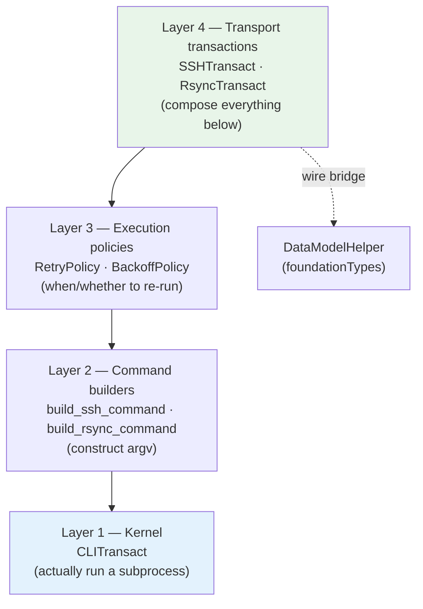

- **Policy-ownership rule:** retry/backoff live in Layer 3 and are *composed in*, never baked into the kernel or a transport.
- **Public-surface rule:** each transport exposes the same four-method shape as the kernel.
- **Wire bridge:** a transport can be handed a `DataModelHelper` subclass and return parsed models, via `wire_invoke` + `from_wire` (see [foundationTypes](foundationTypes.md#the-three-slot-wire-contract)).

---

## cli_transaction: CLITransact

`foundation_tools/cli_transaction/cliTransact.py` is the Layer-1 kernel — a thin, total wrapper over `subprocess` / asyncio subprocess execution. Full contract: [`.claude/specs/cliTransact.md`](../.claude/specs/cliTransact.md).

### The public surface — four stateless classmethods

```python
from foundation_tools.cli_transaction.cliTransact import CLITransact

r = CLITransact.run_sync("echo hello")                       # sync
r = await CLITransact.run_async(["ls", "-la"])               # async
r = CLITransact.run_sync_with_model(DiskUsage)               # sync + parse into a model
r = await CLITransact.run_async_with_model(cmd, parser)      # async + parse
```

Each takes a keyword-only `timeout` and optional `success_marker`. **String commands run through the shell (`shell=True`) and are injection-prone; list commands run directly and are preferred.**

### It never raises on execution

Every execution failure — timeout, non-zero exit, or a contained exception — is captured into a `CLITransactResult`, never thrown. Only `BaseException` escapes.

```python
@dataclass
class CLITransactResult:
    return_code: int          # 0 = success; >0 = command error; -1 = framework sentinel
    stdout: str | None        # normalized; None if empty/whitespace-only
    stderr: str | None
    success: bool             # return_code == 0 AND (no marker OR marker in stdout)
```

`success` is a *semantic* judgment, not just the exit code: if you pass `success_marker="deployment complete"`, the command must also print that string.

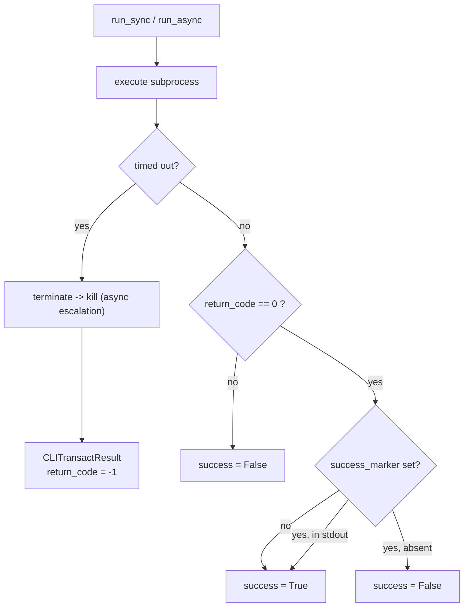

The async timeout path escalates **`terminate` → `kill`** so a process ignoring SIGTERM is still reaped.

### The model bridge

`*_with_model` turns command output into a typed `DataModelHelper`. Two call shapes:

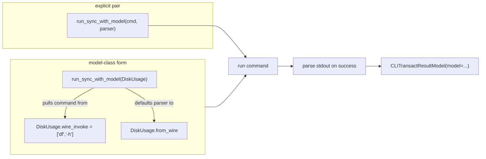

The bare-model form raises `ValueError` **before any subprocess runs** if `wire_invoke` is unset or holds an arm the CLI transport can't support. Parsing runs only on success with non-empty stdout, and a parser failure never flips `success` — it is appended to stderr.

---

## Command builders

`foundation_tools/builders/` — Layer 2. Pure functions that construct argv lists; they run nothing.

- **`build_ssh_command(...)`** (`ssh_builder.py`) — assemble an `ssh` invocation (host, user, port, options, remote command).
- **`build_rsync_command(...)`** (`rsync_builder.py`) — assemble an `rsync` invocation, optionally injecting an SSH transport for the `-e` option, with defined option precedence and a Windows/MSYS2 preset.

Keeping construction separate from execution means the argv can be unit-tested without spawning anything, and the same builder feeds sync, async, and retrying callers.

---

## Execution policies

`foundation_tools/policies/` — Layer 3. Composable "should I run this again?" logic, decoupled from *what* is being run.

### BackoffPolicy — pure delay computation (never sleeps)

```python
from foundation_tools.policies.backoff_policy import BackoffPolicy

b = BackoffPolicy(base_delay=0.5, max_delay=30.0, jitter=True)
b.compute_delay(0)   # ~0.5s   (base * 2^0), then uniform(0, that) because jitter
b.compute_delay(3)   # min(30, 0.5 * 2^3) = 4.0s, jittered
```

`delay = min(max_delay, base_delay * 2^attempt)`, optionally replaced by `random.uniform(0, delay)` when `jitter` is set — full jitter spreads synchronized retry storms across callers. It computes; it never sleeps.

### RetryPolicy — orchestration with injected sleepers

```python
from foundation_tools.policies.retry_policy import RetryPolicy

policy = RetryPolicy(
    max_attempts=5,
    transient_return_codes=frozenset({-1, 255}),   # only these are retried
    backoff=b,
)
result = policy.run_sync(lambda: CLITransact.run_sync(cmd))
result = await policy.run_async(lambda: CLITransact.run_async(cmd))
```

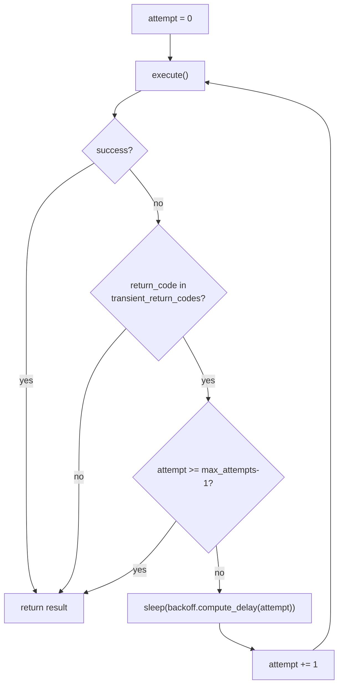

The sleepers are injected (`sync_sleeper` / `async_sleeper` default to `time.sleep` / `asyncio.sleep`), so tests pass a no-op and run instantly. A non-transient failure terminates immediately with the result as-is.

---

## SSH and rsync transactions

`foundation_tools/cli_transaction/` — Layer 4. Each composes a builder + the kernel (+ optional policy) and exposes the **same four-method shape** as `CLITransact`.

| Transport | Class | Spec |
|---|---|---|
| SSH remote command | `SSHTransact` (`sshTransact.py`) | [`.claude/specs/sshTransact.md`](../.claude/specs/sshTransact.md) |
| rsync file sync | `RsyncTransact` (`rsyncTransact.py`) | [`.claude/specs/rsyncTransact.md`](../.claude/specs/rsyncTransact.md) |

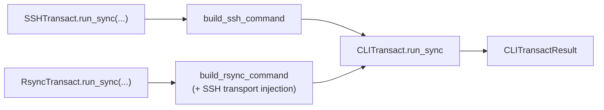

Both offer `run_sync` / `run_async` and `run_sync_with_model` / `run_async_with_model`, so a remote command's output can be parsed straight into a `DataModelHelper` exactly like the local kernel.

---

## socket transaction

`foundation_tools/socket_transaction/` — a **fully asynchronous** request/reply stack over TCP, its own four layers mirroring the CLI stack's ethos. Full contract: [`.claude/specs/socketTransact.md`](../.claude/specs/socketTransact.md).

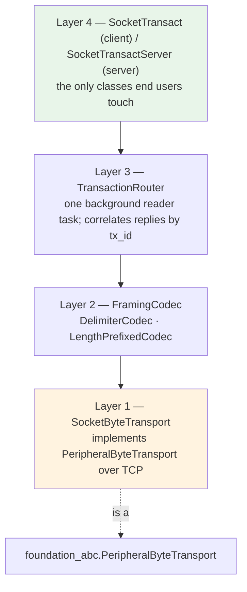

### Layer 1 — SocketByteTransport

`socket_byte_transport.py` implements the [`PeripheralByteTransport`](foundation_abc.md#peripheralbytetransport) ABC over an asyncio TCP socket: `connect` / `disconnect` / `send` / `receive` / `is_connected`. Because it satisfies that ABC, anything written against the byte-transport interface works over sockets unchanged.

### Layer 2 — framing codecs

`framing_codecs.py` turns a raw byte stream into discrete frames. A `FramingCodec` is a `Protocol` with two methods:

- `encode(payload) -> bytes` — frame one outbound message.
- `feed(data) -> list[bytes]` — push inbound bytes, get back zero or more complete frames (it buffers partial frames internally).

| Codec | Framing strategy |
|---|---|
| `DelimiterCodec` | frames terminated by a delimiter byte sequence (the default) |
| `LengthPrefixedCodec` | each frame prefixed with its length |

### Layer 3 — TransactionRouter

`transaction_router.py` owns the **single background reader task** for a connection and correlates each reply to its request by transaction id. Uncorrelated inbound frames are surfaced separately as an *unsolicited* stream. It raises `ConnectionClosedError` (a `ConnectionError`) when the peer goes away.

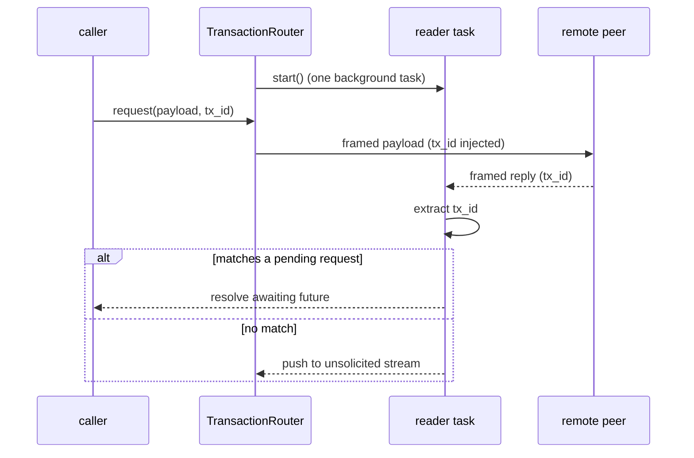

### Layer 4 — SocketTransact (client)

`socketTransact.py` is the only client class you touch. It wires the default stack (`SocketByteTransport` → codec → `TransactionRouter`) and, like `CLITransact`, **never raises on a request** — timeouts, connection loss, and codec errors are captured into the result.

The `tx_id_injector` / `tx_id_extractor` pair is **required** — the correlation format is protocol-specific and the stack defines none of its own.

```python
async with SocketTransact(
    host, port,
    tx_id_injector=my_injector,
    tx_id_extractor=my_extractor,
) as st:
    result = await st.request(b"PING")                       # -> SocketTransactResult
    typed  = await st.request_with_model(req_model, Reply)    # send model, parse reply.from_wire
    await st.send(b"fire-and-forget")                         # uncorrelated; raises on transport error
    async for frame in st.unsolicited():                     # server-pushed frames
        ...
```

`request_with_model` mirrors the CLI bridge: send a `DataModelHelper` (via `to_wire`) or raw bytes, and parse the reply via `model_type.from_wire`. Parsing runs only on a non-empty successful reply and never changes `success`.

### Layer 4b — SocketTransactServer

`socketTransactServer.py` is the server counterpart: it accepts connections, services requests, and can `broadcast` to every connected client. Lifecycle is `start` / `stop` / `serve_forever`, with `address` reporting the bound `(host, port)`.

---

## file_tools

`foundation_tools/file_tools/path_tools.py`. The public entry point is **`find_matching_paths`**, which expands one relative filename glob across a set of extensions and resolves it beneath a required absolute root.

```python
from pathlib import Path

from foundation_tools.file_tools import find_matching_paths

# Resolves beneath root, sorts, de-dupes, and removes excluded matches.
find_matching_paths(Path("/proj"), "data", None)
# extensions=None matches any extension ({pattern}.*)
```

The operation has one rooted control flow:

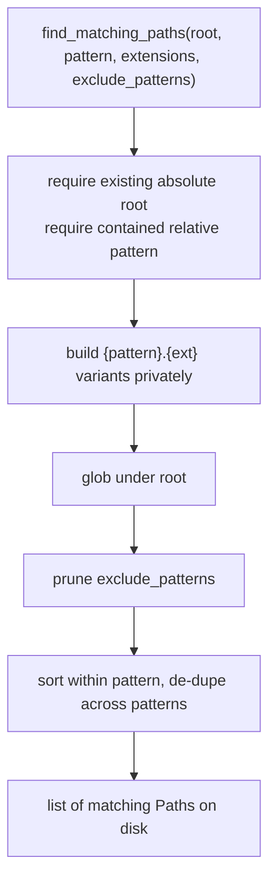

`root` must be an existing absolute `Path`; the function never infers the process working directory. Key rules for `extensions`: `None` matches any extension (`{pattern}.*`); an empty sequence uses the pattern unchanged; leading dots are optional and blanks ignored. For `exclude_patterns`, an entry with a leading/trailing `/` is a **directory** glob that removes the whole subtree from results; an entry with no slash is a **file** glob matched against the final component only. Defaults come from `DEFAULT_EXTENSIONS`, `ANY_EXTENSION`, and `DEFAULT_EXCLUDED_PATTERNS`; pass `[]` to disable filtering.

---

## presentation

`foundation_tools/presentation/` — pure, stdlib-only resolvers for the Presentations schema (the models live in [`foundationTypes/presentationTypes/`](foundationTypes.md#model-families)). See [`.claude/specs/presentationSchema.md`](../.claude/specs/presentationSchema.md).

### units.py — the pixel ↔ EMU conversion

The single repository-wide definition of the pixel-to-EMU mapping. The canvas is 1920×1080 px over a 16:9 slide at exactly 144 px/in; PowerPoint uses EMU at 914400 per inch, so the mapping is **exactly `914400 / 144 = 6350` EMU per pixel — no rounding.**

```python
from foundation_tools.presentation.units import EMU_PER_PX, px_to_emu, emu_to_px

EMU_PER_PX          # 6350  (exact; no other module may re-derive it)
px_to_emu(1920)     # 12192000  (PowerPoint widescreen width)
emu_to_px(6858000)  # 1080.0
```

### layout_resolver.py — ids to geometry

Resolves a layout id to a layout, a region id to a region, and a slide's title/subtitle to their reserved regions. Each resolver returns a small result object with an `ok` flag rather than raising, so a caller can validate a whole deck and collect every failure.

- `resolve_layout(layouts, layout_id) -> LayoutResult`
- `resolve_region(layout, region_id) -> RegionResult`
- `resolve_slide_text(layout, slide) -> SlideTextResult` — binds title/subtitle text to regions.

### theme_resolver.py — semantic colors and contrast

A deck never carries a literal color; it names a semantic role that the theme resolves to RGB.

- `resolve_color(theme, ref) -> ColorResult` — semantic name → RGB.
- `contrast_ratio(fg, bg) -> float` — WCAG contrast ratio between two colors.
- `validate_theme(theme) -> ThemeReport` — check every foreground/background pairing's contrast, returning a report of `ContrastPairing`s.

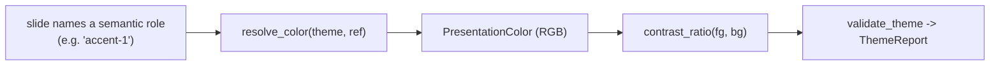

---

## StandardizedLogger

`foundation_tools/standardized_logger.py` defines `StandardizedLogger`, a `logging.Logger` subclass that self-configures its handlers. Its config model, `StandardizedLoggerConfig`, is a schema-generated `DataModelHelper` in [`foundationTypes/`](foundationTypes.md#model-families).

- A **stderr** handler — JSON by default, or human-readable when `console_pretty` is set.
- An optional **date-rolling JSON file** handler when `log_dir` is given.
- `debug` / `info` / `warning` / `error` / `critical` accept arbitrary keyword args, which become **structured JSON fields** on file output.

```python
from foundation_tools.standardized_logger import StandardizedLogger

log = StandardizedLogger.from_config(config)     # or construct directly
log.info("request handled", request_id="abc", duration_ms=42)
# file output: {"level": "INFO", "msg": "request handled", "request_id": "abc", "duration_ms": 42, ...}
```

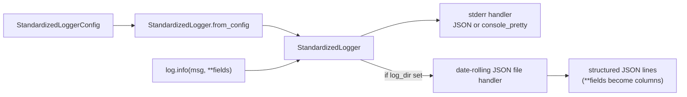
