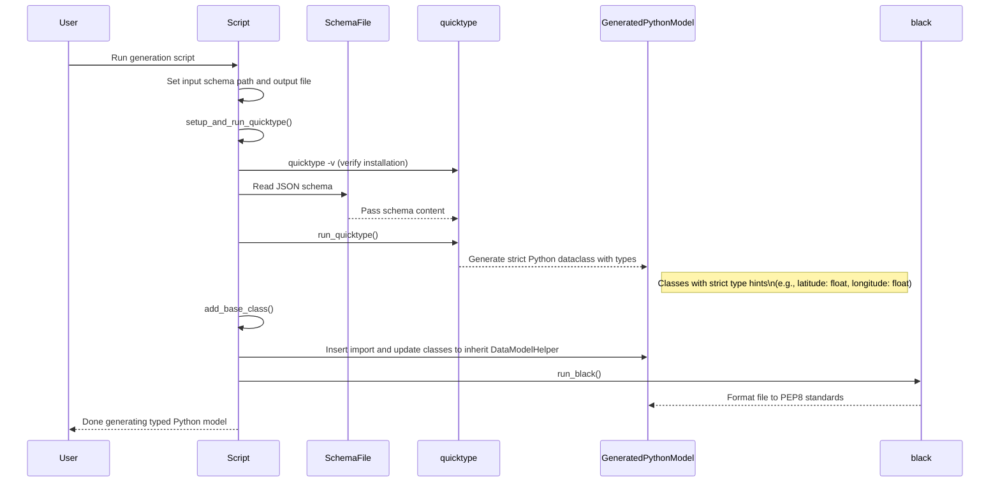

# Schema-Driven Data Model Generation

This directory contains the schema-driven workflow for generating strongly-typed Python data models from JSON Schema definitions. The workflow automatically creates Python dataclasses with type hints, validation, and serialization capabilities.

## Overview

The workflow transforms JSON Schema → Python dataclasses with these features:
- **Type Safety**: Strict type hints generated from schema definitions
- **Validation**: Schema constraints enforced at runtime
- **Serialization**: Built-in JSON save/load functionality via `DataModelHelper`
- **IDE Support**: Full autocomplete and type checking

## Quick Start

### Install Dependencies
```bash
npm install -g quicktype
pip install black  # For code formatting
```

## Sequence Diagram for helper script:

## How to Extend: Creating New Data Models

### Step 1: Create JSON Schema
Create a new schema file in `schema/schemas/` (GeoCoordinate.json is provided as an example):

```json
{
  "id": "http://json-schema.org/your-model",
  "$schema": "http://json-schema.org/draft-06/schema#",
  "description": "Your data model description",
  "type": "object",
  "required": ["field1", "field2"],
  "properties": {
    "field1": {"type": "string"},
    "field2": {"type": "number"}
  }
}
```

### Step 2: Create Generation Script
Copy and modify `scripts/generateGeoCoordinate.sh`:

```bash
#!/bin/bash

# === Input Schemas ===
INPUT_SCHEMA_FILES=(
  "schema/schemas/YourModel.json"
)
CLASSES_FOR_BASE_PARENT=(
    "YourModel"
)

# === Output Directory ===
OUTPUT_PYTHON_FILE="src/dataModelHelpers/commonTypes/YourModel.py"

# Rest of script remains the same...
```

### Step 3: Run Generation
```bash
./schema/scripts/generateYourModel.sh
```

### Step 4: Verify Generated Code
The script generates a Python file like:

```python
@dataclass
class YourModel(DataModelHelper):
    field1: str
    field2: float

    @staticmethod
    def from_dict(obj: Any) -> "YourModel":
        # Auto-generated validation and conversion

    def to_dict(self) -> dict:
        # Auto-generated serialization
```

### Step 5: Use Your Data Model
```python
from dataModelHelpers.commonTypes.YourModel import YourModel

# Create instance
model = YourModel(field1="test", field2=123.45)

# Save to file
model.saveToFile(Path("data.json"))

# Load from file
loaded = YourModel.loadFromFile(Path("data.json"))
```

## Workflow Diagram



## JSON Schema Resources

This workflow is built on [JSON Schema](https://json-schema.org/), a vocabulary that allows you to annotate and validate JSON documents.

### Key Resources
- **[JSON Schema Specification](https://json-schema.org/specification.html)** - Official specification and documentation
- **[JSON Schema Guide](https://json-schema.org/learn/)** - Step-by-step learning guide
- **[Schema Examples](https://json-schema.org/learn/miscellaneous-examples.html)** - Real-world schema examples
- **[JSON Schema Validator](https://www.jsonschemavalidator.net/)** - Online tool to test your schemas
- **[Understanding JSON Schema](https://json-schema.org/understanding-json-schema/)** - Comprehensive tutorial

### Schema Best Practices
- Use descriptive `$id` and `description` fields
- Define `required` fields explicitly
- Use appropriate data types (`string`, `number`, `boolean`, `object`, `array`)
- Add format validation where applicable (`email`, `date-time`, `uri`)
- Keep schemas focused and composable